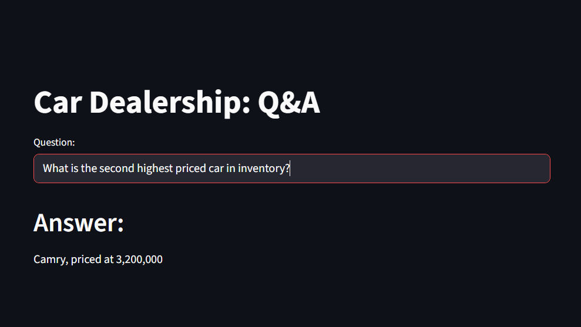
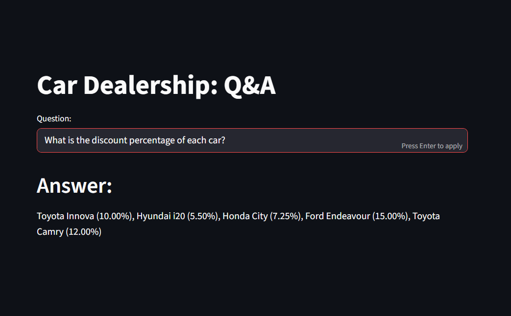

# Car Dealership Q&A Bot


This is an interactive chatbot built with **LangChain**, **Streamlit**, and **Gemini 2.0 Flash** that connects to a car dealership's SQL database and answers real-world dealership queries.

---

### Streamlit App Interface





---

### Features

- Natural language understanding with Gemini
- Few-shot learning using LangChain prompt engineering
- MySQL database access through LangChain SQLDatabaseChain
- Fast and minimal UI with Streamlit
- Example-based querying using semantic similarity and ChromaDB

---

### Sample Questions You Can Ask

- What is the price of the Toyota Camry?
- How many SUV cars are in stock?
- What discount percentage is offered on each car?

---

### Directory Structure

```
CarDealershipChatBot/
├── .env
├── main.py
├── few_shots.py
├── helper_function.py
├── requirements.txt
├── car_dealership.ipynb
└── cars.sql
```

---

### Requirements

- streamlit
- langchain
- google-generativeai
- pymysql
- chromadb
- python-dotenv
- huggingface\_hub
- sentence-transformers

---

### How to Run on Local Machine

```bash
# Clone the repo
git clone https://github.com/dchaitanya1/CarDealershipChatBot.git
cd CarDealershipChatBot

# Create virtual environment
python -m venv .venv
.venv\Scripts\activate    # (for Windows)

# Install dependencies
pip install -r requirements.txt

# Add your Google API key
echo "GOOGLE_API_KEY=your_key" > .env

# Run the Streamlit app
streamlit run main.py
```

---
